# Deep Hedging with DRL - Analysis Report

**Date:** 2026-05-03 23:59:29

## Executive Summary

**Overall Winner:** Full Hedge
- Sharpe Ratio: -10.7015
- Mean PnL: $-2.05
- Win Rate: 25.0%
- Max Drawdown: -25265.9%

### DRL vs Classical Comparison

**Best DRL:** DRL_TD3 (Sharpe: -24.9401)
**Best Classical:** Full Hedge (Sharpe: -10.7015)

Classical outperforms DRL by 14.2386

## Performance Summary

| Strategy | Type | Sharpe | Mean PnL | Win Rate | Max DD | VaR (95%) |
|----------|------|--------|----------|----------|--------|-----------|
| Full Hedge | classical | -10.702 | $-2 | 25.0% | -25265.9% | $-8 |
| No Hedge | classical | -11.963 | $-4 | 0.0% | -0.0% | $-12 |
| Constant 50% Hedge | classical | -20.712 | $-3 | 0.0% | -0.0% | $-6 |
| DRL_TD3 | drl | -24.940 | $-4 | 5.0% | -0.0% | $-8 |
| DRL_PPO | drl | -26.664 | $-5 | 0.0% | -0.0% | $-10 |
| DRL_SAC | drl | -29.078 | $-5 | 0.0% | -0.0% | $-9 |
| Black-Scholes Delta | classical | -121.212 | $-6 | 0.0% | -0.0% | $-7 |

## DRL Agents Comparison

| Agent | Type | Sharpe | Mean PnL | Win Rate | Max DD |
|-------|------|--------|----------|----------|--------|
| DRL_TD3 | DRL | -24.940 | $-4 | 5.0% | -0.0% |
| DRL_PPO | DRL | -26.664 | $-5 | 0.0% | -0.0% |
| DRL_SAC | DRL | -29.078 | $-5 | 0.0% | -0.0% |

## Visualizations

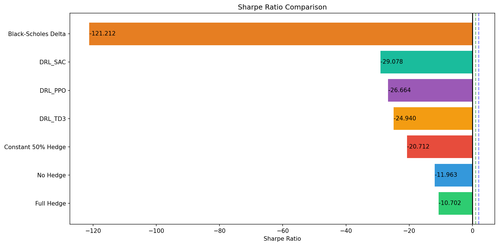
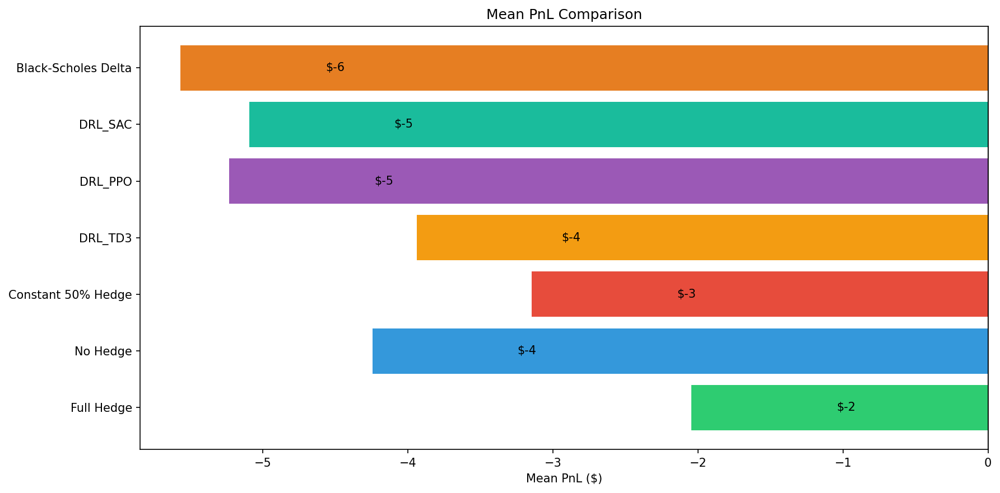
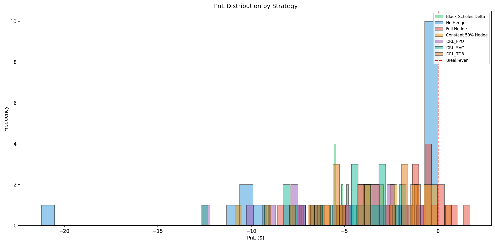
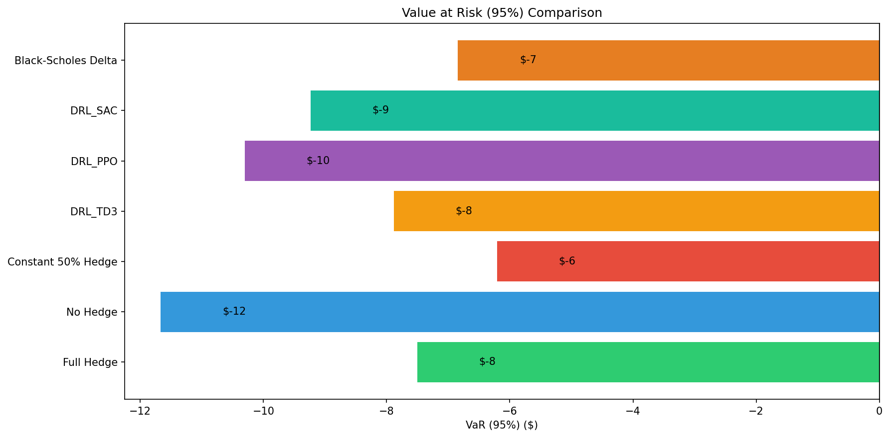
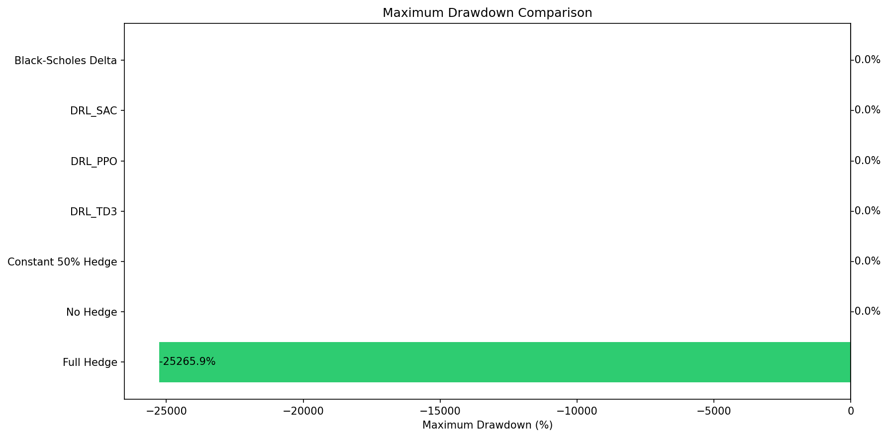
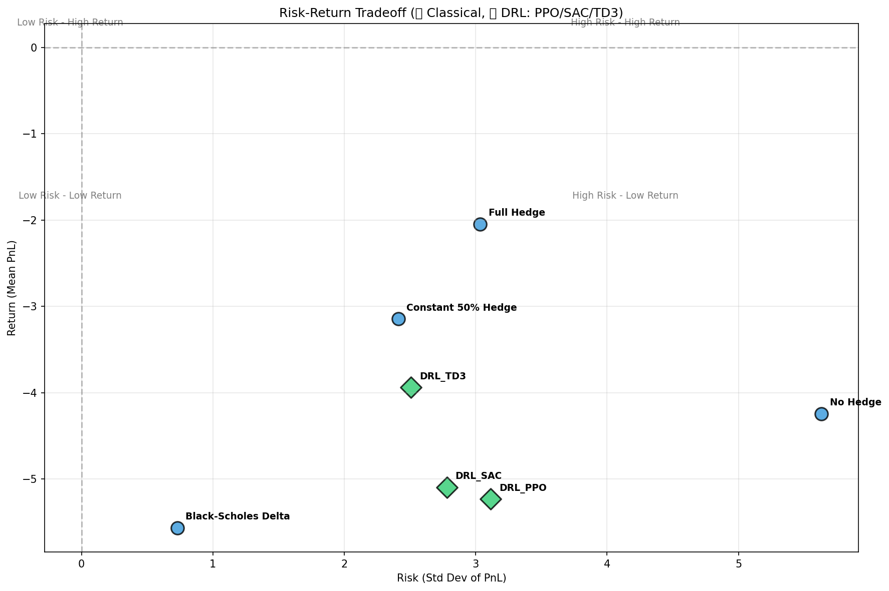
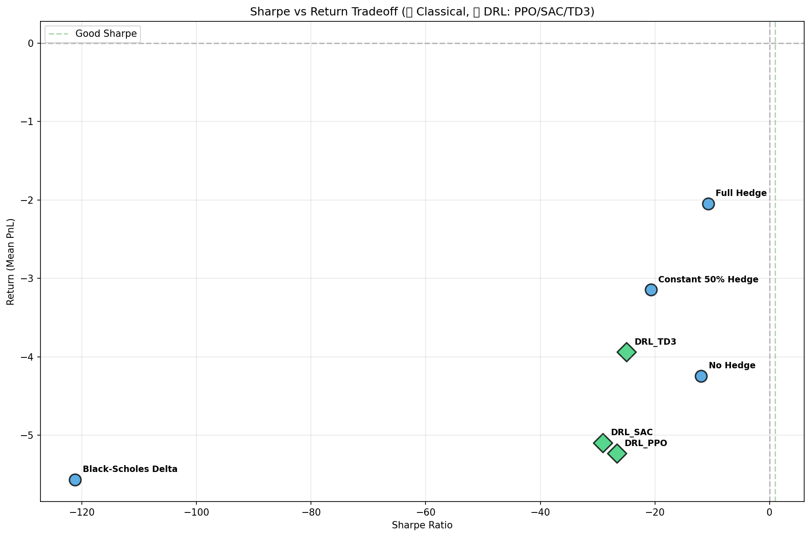
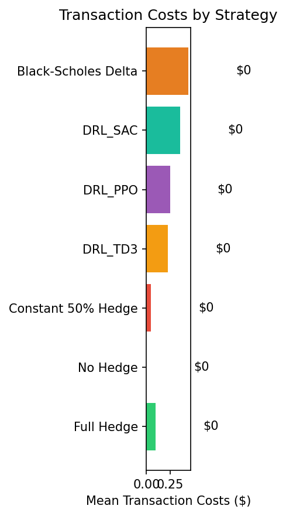
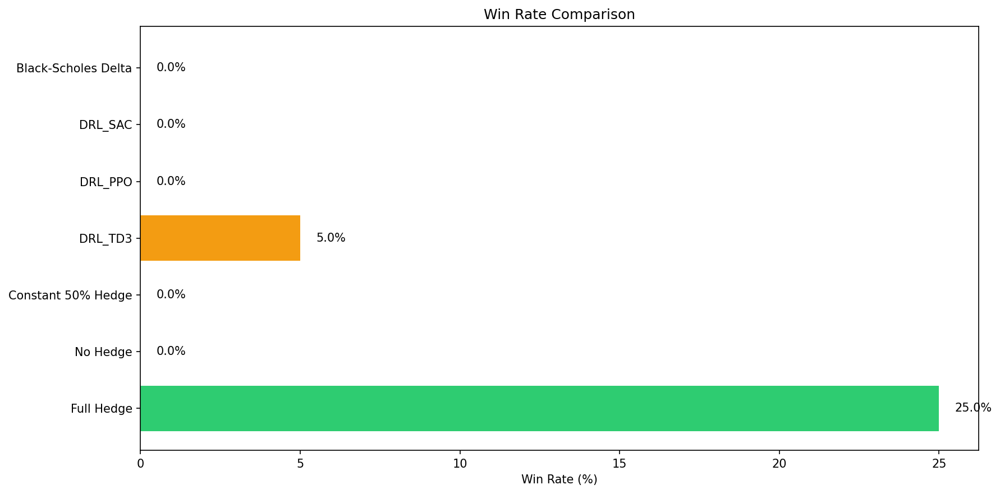
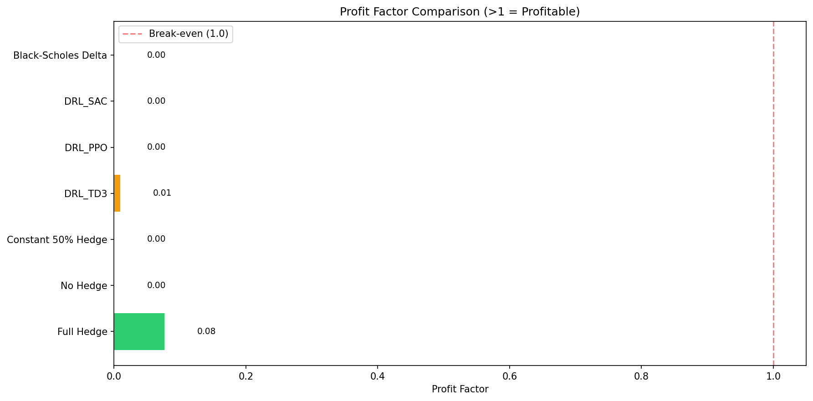
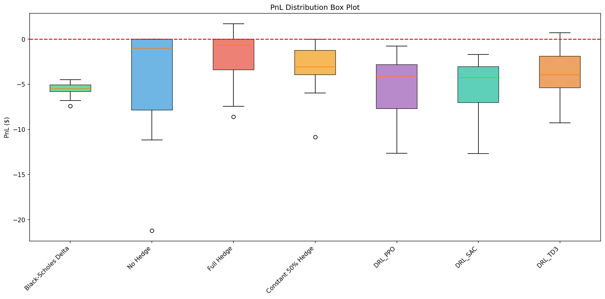